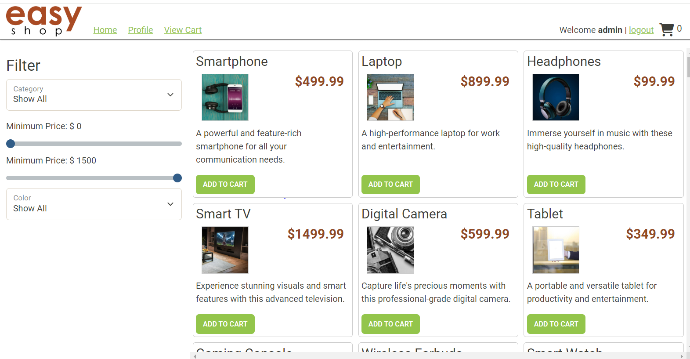
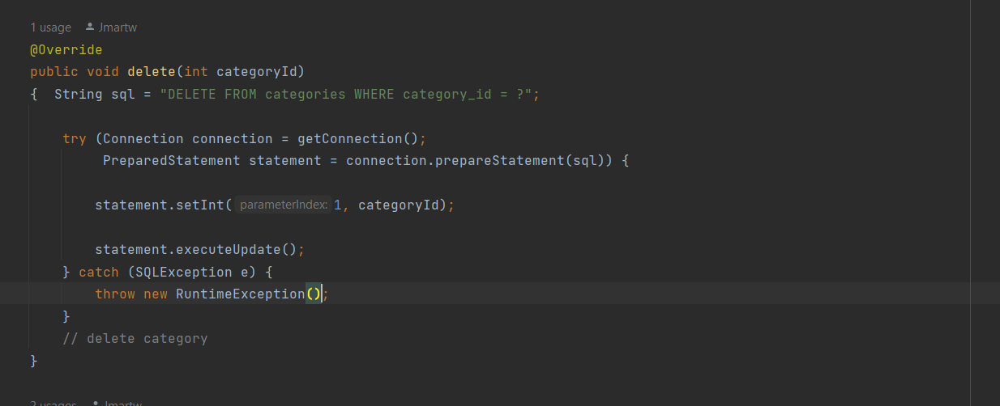

## EASY SHOP!

### E-commerce API products searching capstone 

##### Through this API which is an extensive system formulated into packages which has frontend and backend contributing attributes. The controller package encapsulates the core functionalities. This presents all of the controller classes needed for the program to be able to run smoothly involving the products, categories, and shopping cart. All controller classes has specific tasks based on what functions it is related to. The website that the project uses has an interface which gives users the ability to view products and organize them by price, colors and configure their shopping experience to their liking. 

-----------
## Demonstration 

### Showing how I made the project bugs work as well as a screenshot of the store to show what the user sees and my favorite piece of code.

## Bug #1 

## Bug #2

## Store 

-------
## Favorite piece of code 

-------
## For future references 

-----
## THANK YOUUU

### I want to thank everyone because everyone in section 10 has helped me with something at this point throughout this program and I defintely would not have pulled through without having you guys to lean on.